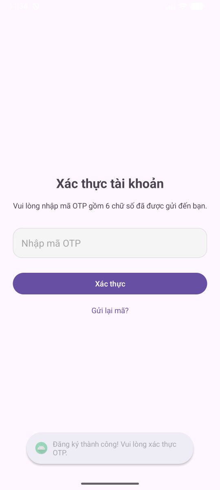

# 🍵 UTE TEA - Android App

> Ứng dụng đặt trà sữa trực tuyến cho sinh viên UTE

[](https://developer.android.com)
[](https://www.oracle.com/java/)
[](https://square.github.io/retrofit/)

---

## 📱 Giới thiệu

**UTE Tea Android App** là ứng dụng mobile cho phép sinh viên UTE đặt trà sữa online, xem menu, tìm cửa hàng và theo dõi đơn hàng.

### ✨ Tính năng chính

- 🔐 Đăng ký / Đăng nhập với JWT authentication
- 🥤 Xem menu 16+ món nước với 4 categories
- 🏪 Tìm kiếm 2 cửa hàng UTE
- 🛒 Đặt hàng online (Delivery/Pickup)
- 🎟️ Áp dụng mã giảm giá
- 📦 Theo dõi đơn hàng
- 👤 Quản lý tài khoản và member tier

---

## 🚀 Quick Start

### 1. Chạy Backend
```bash
cd Backend_UTEtea
.\mvnw.cmd spring-boot:run
```

### 2. Cấu hình Base URL

**Emulator (mặc định):**
```java
// RetrofitClient.java
private static final String BASE_URL = "http://10.0.2.2:8080/api/";
```

**Thiết bị thật:**
```java
// Thay YOUR_IP bằng IP máy tính (tìm bằng ipconfig)
private static final String BASE_URL = "http://192.168.1.100:8080/api/";
```

### 3. Build & Run
```bash
# Mở Android Studio
# Build > Make Project
# Run > Run 'app'
```

### 4. Test Login
```
Username: ute_student_01
Password: 123456
```

✅ Done! App đã kết nối với backend.

---

## 📚 Documentation

| File | Mô tả |
|------|-------|
| [QUICK-TEST.md](QUICK-TEST.md) | ⚡ Test app trong 5 phút |
| [ANDROID-API-SETUP.md](ANDROID-API-SETUP.md) | 📖 Hướng dẫn setup chi tiết |
| [EXAMPLE-USAGE.md](EXAMPLE-USAGE.md) | 💻 Code examples |
| [CHANGES-SUMMARY.md](CHANGES-SUMMARY.md) | 📋 Tóm tắt thay đổi |

---

## 🏗️ Kiến trúc

```
app/src/main/java/com/example/doan/
├── Activities/          # Các màn hình
│   ├── LoginActivity
│   ├── RegisterActivity
│   ├── MainActivity
│   └── ...
├── Fragments/           # Các tab
│   ├── HomeFragment     # Menu món
│   ├── StoreFragment    # Cửa hàng
│   ├── OrderFragment    # Đơn hàng
│   └── AccountFragment  # Tài khoản
├── Adapters/            # RecyclerView adapters
│   ├── DrinkAdapter
│   ├── StoreAdapter
│   └── OrderAdapter
├── Models/              # Data models
│   ├── Drink, Category, Store
│   ├── LoginRequest/Response
│   └── ApiResponse
├── Network/             # API layer
│   ├── RetrofitClient   # Retrofit setup
│   ├── ApiService       # API endpoints
│   └── AuthInterceptor  # JWT handler
└── Utils/               # Utilities
    └── SessionManager   # User session
```

---

## 🔧 Công nghệ

### Core
- **Language:** Java 11
- **Min SDK:** 24 (Android 7.0)
- **Target SDK:** 36

### Libraries
- **Retrofit 2.9.0** - REST API client
- **Gson** - JSON parsing
- **OkHttp** - HTTP client & logging
- **Glide 4.16.0** - Image loading
- **Material Design** - UI components

---

## 🌐 API Integration

### Backend
- **Base URL:** `http://localhost:8080/api/`
- **Framework:** Spring Boot 3.5.7
- **Database:** MySQL 8.0
- **Auth:** JWT Token

### Endpoints đã implement

#### Authentication
```
POST /auth/login       - Đăng nhập
POST /auth/register    - Đăng ký
GET  /auth/health      - Health check
```

#### Drinks & Categories
```
GET /drinks            - Lấy tất cả món
GET /drinks/{id}       - Chi tiết món
GET /drinks/search     - Tìm kiếm món
GET /categories        - Lấy categories
```

#### Stores
```
GET /stores            - Lấy cửa hàng
GET /stores/{id}       - Chi tiết cửa hàng
```

#### Orders
```
GET /orders/user/{userId}         - Lịch sử đơn
GET /orders/user/{userId}/current - Đơn hiện tại
GET /orders/{orderId}             - Chi tiết đơn
```

---

## 💾 Data Models

### Drink (Món nước)
```java
{
  "id": 1,
  "name": "UTE Houjicha Classic",
  "description": "Trà sữa Houjicha đậm vị...",
  "imageUrl": "/assets/drinks/milk_tea/...",
  "basePrice": 29000,
  "categoryName": "Milk Tea",
  "sizes": [...],
  "toppings": [...]
}
```

### Store (Cửa hàng)
```java
{
  "id": 1,
  "storeName": "UTE Tea - Cơ sở 1",
  "address": "Số 1 Võ Văn Ngân, Thủ Đức",
  "latitude": 10.8512345,
  "longitude": 106.7543210,
  "openTime": "08:00:00",
  "closeTime": "22:00:00",
  "phone": "0901 234 567"
}
```

---

## 🔐 Authentication Flow

```
1. User nhập username/password
2. App gửi POST /auth/login
3. Backend validate và trả về JWT token
4. App lưu token vào SharedPreferences
5. AuthInterceptor tự động thêm token vào mọi request:
   Authorization: Bearer <token>
6. Backend validate token cho protected endpoints
```

### SessionManager
```java
SessionManager session = new SessionManager(context);

// Sau khi login
session.saveLoginSession(userId, username, fullName, phone, role, memberTier, token);

// Kiểm tra login
if (session.isLoggedIn()) { ... }

// Lấy thông tin
int userId = session.getUserId();
String token = session.getToken();
boolean isManager = session.isManager();

// Logout
session.logout();
```

---

## 🧪 Testing

### Test Accounts
```
Username: ute_student_01  | Password: 123456 | Role: USER (BRONZE)
Username: ute_student_02  | Password: 123456 | Role: USER (SILVER)
Username: ute_student_03  | Password: 123456 | Role: USER (GOLD)
Username: manager_ute     | Password: 123456 | Role: MANAGER
```

### Test trên Emulator
1. Chạy backend: `.\mvnw.cmd spring-boot:run`
2. BASE_URL: `http://10.0.2.2:8080/api/`
3. Run app trên emulator
4. Login với account test

### Test trên thiết bị thật
1. Tìm IP máy tính: `ipconfig`
2. Cập nhật BASE_URL: `http://YOUR_IP:8080/api/`
3. Đảm bảo cùng WiFi
4. Run app trên điện thoại

---

## 🐛 Troubleshooting

### Unable to resolve host
- Kiểm tra backend đã chạy
- Kiểm tra BASE_URL đúng
- Kiểm tra firewall

### Connection timeout
- Tăng timeout trong RetrofitClient
- Kiểm tra backend logs
- Test API với Swagger UI

### 401 Unauthorized
- Login lại để lấy token mới
- Kiểm tra AuthInterceptor
- Clear app data

### Ảnh không load
- Kiểm tra imageUrl từ API
- Sử dụng `RetrofitClient.getBaseUrl() + imageUrl`
- Kiểm tra ảnh tồn tại trong backend

---

## 📦 Build

### Debug Build
```bash
./gradlew assembleDebug
```

### Release Build
```bash
./gradlew assembleRelease
```

APK output: `app/build/outputs/apk/`

---

## 🔄 Next Steps

### Cần implement
- [ ] Cập nhật LoginActivity sử dụng API mới
- [ ] Cập nhật RegisterActivity
- [ ] HomeFragment hiển thị drinks từ API
- [ ] StoreFragment hiển thị stores từ API
- [ ] OrderFragment tạo và theo dõi đơn hàng
- [ ] AccountFragment hiển thị user info
- [ ] Implement order creation flow
- [ ] Add loading states và error handling
- [ ] Implement image caching

### Tính năng mở rộng
- [ ] Push notifications cho order status
- [ ] Google Maps integration cho stores
- [ ] Payment gateway integration
- [ ] Order rating và review
- [ ] Favorites drinks
- [ ] Order history với filter
- [ ] Promotion notifications

---

## 👥 Team

**Đồ án Lập trình Di động - UTE Tea**

- Backend: Spring Boot + MySQL
- Android: Java + Retrofit
- Database: MySQL 8.0

---

## 📄 License

MIT License

---

## 🙏 Acknowledgments

- Spring Boot Backend API
- Retrofit for Android
- Glide for image loading
- Material Design Components

---

## 📞 Support

Nếu gặp vấn đề:
1. Đọc [QUICK-TEST.md](QUICK-TEST.md)
2. Xem [ANDROID-API-SETUP.md](ANDROID-API-SETUP.md)
3. Check backend logs
4. Test API với Swagger UI: `http://localhost:8080/swagger-ui.html`

---

**Happy Coding! 🎉**

*Last updated: November 27, 2025*


===============================





